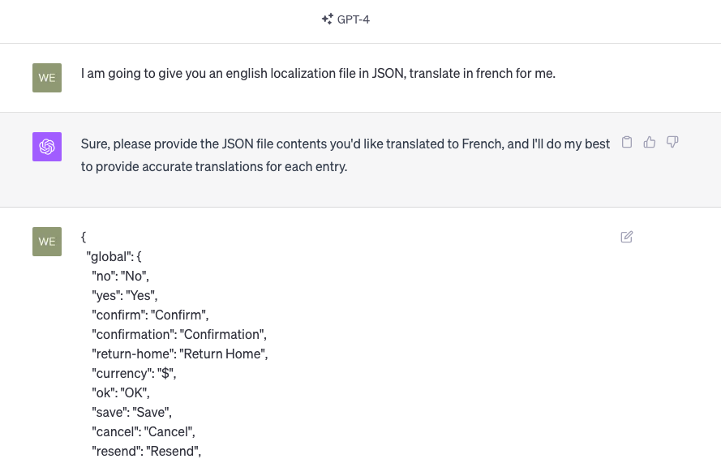
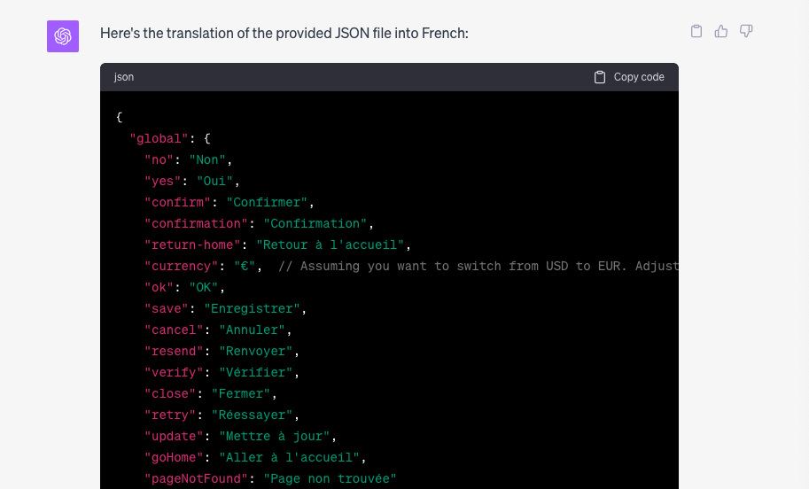
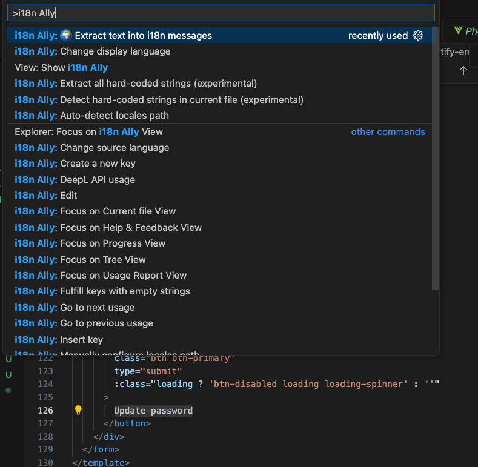

# Adding a translation

If your language file is not available in the [locales](../../src/locales/) directory, you need to add a new language.

If your language file is available in the locales directory but you can see that some text is not being translated, you need to add a translation entry.

## Adding a new language

### Add the translation file

In the [locales](../../src/locales/) directory, create a new file following the naming convention: `<ISO 639-1>-<ISO 3166-1 alpha-2>.json`.

* The [ISO 639-1](https://en.wikipedia.org/wiki/List_of_ISO_639-1_codes) code is used to determine the language
* The [ISO 3166-1 alpha-2](https://en.wikipedia.org/wiki/ISO_3166-1_alpha-2) code is a two letter country code, used to determine which flag should be shown.

For example, for spanish, the file could be named `es-ES.json`.

### Add the translation

The easiest way to translate each entry is to ask ChatGPT to do it.
Here is a prompt you can use:

> I am going to give you an english localization file in JSON, translate in french for me.



ChatGPT will give you the new file in return:



Note that you might split the file in multiple parts due to ChatGPT tokens limitations.

### It's all automatic

Once the new translation file (`es-ES.json`) is placed in the `locales` directory, the translations will automatically be picked up and the LocaleSwitcher component will automatically suggest the new language.

## Adding a new translation entry

If you don't see some text being translated, there are two possible reasons:

1. The text is hardcoded: it is not using a translation key
2. The text uses a translation key, but the translation is missing for your language

### Extracting hardcoded text

1. Find the hardcoded text
2. Create a new entry in your language file with this text
3. Reference the entry

For example, this button

```jsx
<button class="btn btn-primary" type="submit">
    Update password
</button>
```

Becomes this:

```jsx
<button class="btn btn-primary" type="submit">
    {{ $t('password.updatePassword') }}
</button>
```

To make this task easier, you should use the VSCode extension [Lokalise i18n Ally](https://marketplace.visualstudio.com/items?itemName=Lokalise.i18n-ally).

This free extension will:
* replace translation keys to their values in your editor to make it easier to read for you (you can even configure which language is used)
* automatically detecting hardcoded text
* automatically extract a selected text and create a new entry for you in the current language file
* indicate which entries are missing, for which languages
* automatically translate entries for you



### Translating a missing entry

1. Find the missing entry
2. Update your language file to add this missing entry with the translation

For example, let's say you have a french file `fr-FR.json` like this:


```json
{
    "global": {
        "yes": "Oui",
        "no": "Non",
    }
}
```

And `en-US.json` has an additional entry:

```json
{
    "global": {
        "yes": "Yes",
        "no": "No",
        "retry": "Retry"
    }
}
```

Simply update the file `fr-FR.json` like this:


```json
{
    "global": {
        "yes": "Oui",
        "no": "Non",
        "retry": "Réessayer"
    }
}
```

Or make your life easier and use [Lokalise i18n Ally](https://marketplace.visualstudio.com/items?itemName=Lokalise.i18n-ally) in VS Code. 