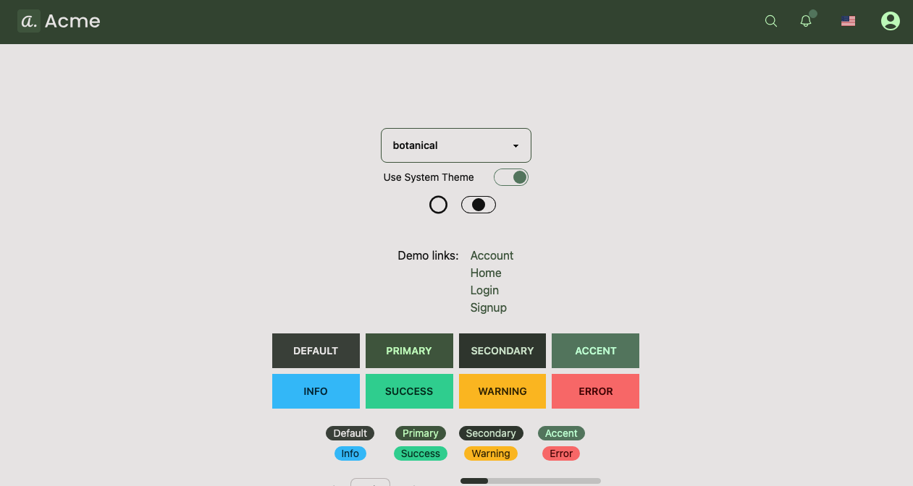
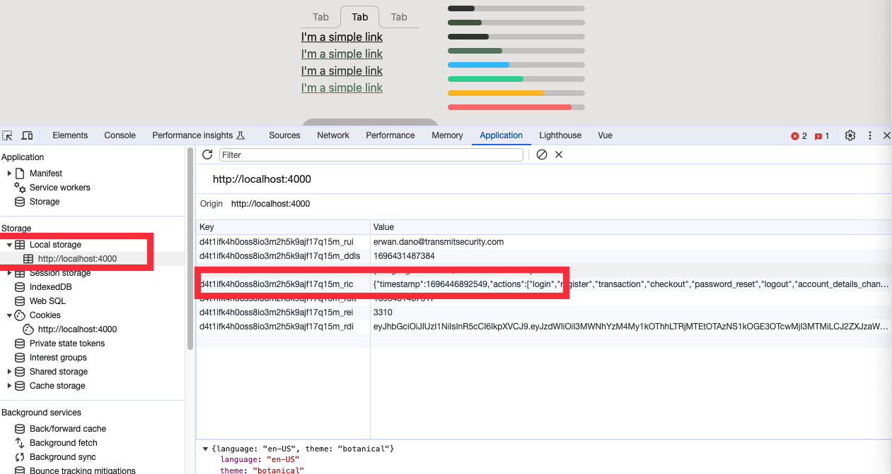

# How to select a theme

## Selecting a theme

Navigate to [http://localhost:4000/theme-preview](http://localhost:4000/theme-preview).
Select a theme from the dropdown.
The theme will automatically change and you will be able to preview most of the components.




## How theme selection is saved

Whenever you select a theme, the selection is saved in the local storage of your browser.



This value is then loaded when the application is mounted.
You can see it in `App.vue`

```js
onMounted(() => {
  // Set the language based on saved preferences
  if (preference.language !== '' && i18n.locale.value !== preference.language)
    i18n.locale.value = preference.language

  // Set the theme based on the .env configuration or saved preferences
  const theme = preference.theme || import.meta.env.VITE_THEME || 'breeze'
  $theme.set(theme as DaisyThemes)
})
```

## Setting a default theme with the environment file

You can set a default theme with the environment file.
Simply set the variable `VITE_THEME` to one of the existing theme.

```ini
VITE_THEME=retro
```

## List of themes

DaisyUI is the TailwindCSS framework upon which the UI and themes are built.
DaisyUI comes with a lot of pre-defined themes. Their name can be found in the [official documentation](https://daisyui.com/docs/themes/).

If custom themes have been created, they can be found in [tailwind.config.js](../../tailwind.config.js).

To learn how theme colors work, or to create a custom theme, please refer to [this documentation](./theme-customization.md).


