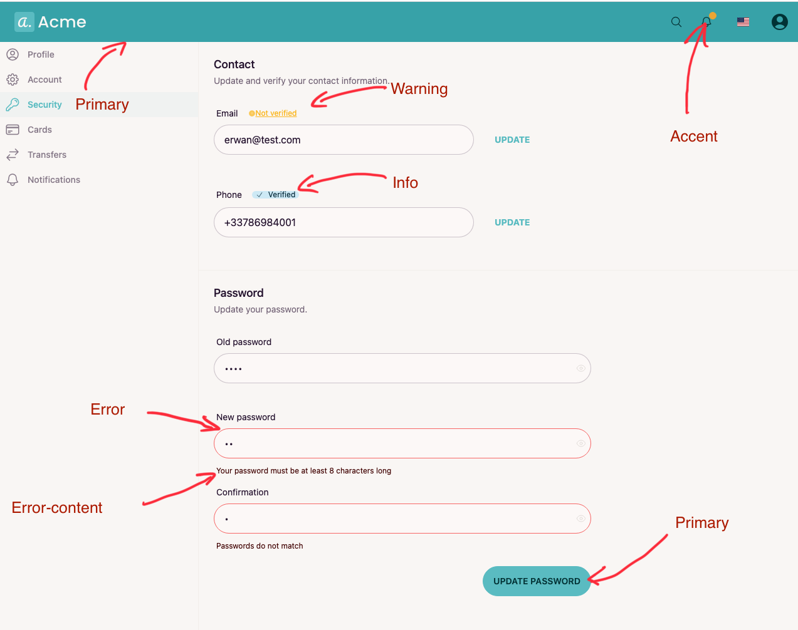

# Create custom themes

DaisyUI is the TailwindCSS framework upon which the UI and themes are built.
DaisyUI comes with a lot of pre-defined themes. Their name can be found in the [official documentation](https://daisyui.com/docs/themes/).

DaisyUI also allows to create custom themes, the official documentation can be found [here](https://daisyui.com/docs/themes/#-4).

## Main theme colors

DaisyUI offers the prototyping power of TailwindCSS without the hassle of having to rewrite every color everywhere. To do this, DaisyUI defines 5 main colors:
* **primary**: this is the main color associated with the brand, if you were building a website for [Dropbox](https://www.dropbox.com/plans) this would be blue used on buttons
* **secondary**: usually another shade of the main color, to use on other buttons
* **accent**: this is a color rarely used but with enough contrast with the primary colors to catch your attention. For [Dropbox](https://www.dropbox.com/plans) this would be the light yellow-green used to show the "best plans"
* **neutral**: usually the color used for footers, or banners where you want some contrast with the main background but don't want to emphasize too much this section
* **base**: the color used for background, it is offered in three variations, gradually darker.

Learn more on [DaisyUI's official documentation](https://daisyui.com/docs/colors/#-2)




## Color variations

Each main color is offered in three variations:
* **Main variation**: example "primary", "secondary", etc. This is just the color as-is.
* **Focus variation**: "primary-focus", "neutral-focus", etc. This is a slightly darker shade of the main color.
* **Content variation**: "secondary-content", "accent-content", etc. This is a readable tone of the main color: usually for text used on the main color.

## Other colors

DaisyUI also offers the following colors to be used with alert, notifications or banners:
* **info**
* **success**
* **warning**
* **error**

Each one has its text color counterpart: "error-content", "info-content", etc.

## Adding a custom theme

Let's say you would like to add a theme called "botanical".

In [tailwind.config.js](../../tailwind.config.js), add at least the colors for:
* primary
* secondary
* accent
* neutral
* base-100

The other colors will be automatically derived from those already provided.

```js
module.exports = {
  //...
  daisyui: {
    themes: [
      {
        botanical: {
          primary: '#475F45',
          secondary: '#343D33',
          accent: '#5c7f67',
          neutral: '#414840',
          'base-100': '#e9e7e7',
        },
      },
      "dark",
      "cupcake",
    ],
  },
}
```

However, you can also specify yourself other colors if you want to.
You can also add some custom css rules to customize DaisyUI components.
In this example we add a rule on buttons by selecting the class `.btn` and then making the buttons rectangular (removing the rounded corners).

```js
module.exports = {
  //...
  daisyui: {
    themes: [
      {
        botanical: {
          primary: '#475F45',
          secondary: '#343D33',
          accent: '#5c7f67',
          neutral: '#414840',
          'neutral-content': '#e9e7e7',
          'base-100': '#e9e7e7',
          'base-content': '#100f0f',
          '.btn': {
            'border-radius': '0px',
          },
        },
      },
      "dark",
      "cupcake",
    ],
  },
}
```

If you want to know more about DaisyUI's components, continue with [this documentation](./use-daisyui.md).